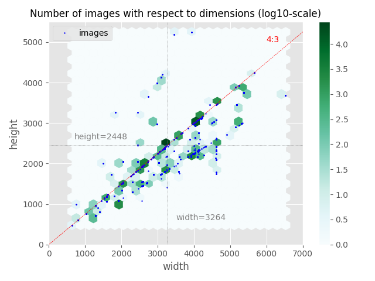

# Notes about Mapillary dataset

Tensorflow does not permit to resize images properly (problem with
`tf.image.resize_images` and `tf.image.resize_image_with_crop_or_pad`) ->
*workaround* prepare the data before piping them into Tensorflow graph

## Data preparation

As inputs, Mapillary provides a bunch of street scene images of various sizes
in a `images` repository, and the same images after filtering process in
`instances` and `labels` repositories. The latter is crucial, as the filtered
images are actually composed of pixels in a reduced set of colors. Actually,
there is one color per object types; and 66 object types in total.

There are 18000 images in the training set, 2000 images in the validation set,
and 5000 images in the testing set. The testing set is proposed only for a
model test purpose, there are not any filtered version of images in it.

### Transform the image into input data

The input of the process will consider images within the `images`
repository. The goal is to transform the initial files into standardized image
files, so as to get `np.array` of fixed shape.

At the end of these transformation steps, input images will be put away in a
`input` repository.

#### Resizing

For all images (train, validation, test), labels (train, validation) and
instances (train, validation), we resize the image according to a single
reference size. As a remark, in the validation dataset, most images seem to be
such as `heights` are `0.75*widths`; and image sizes are comprised between
`600*800` and `3752*5376`. A first approximation could be to resize every
images as the most encountered size (`2448*3264`).

#### Renaming

For a sake of simplicity, the image files are arbitrarily renamed as
`XXXXX.jpg`, `XXXXX` being a number comprised between 0 and 18000 for the
training set, between 0 and 2000 for the validation set and between 0 and 5000
for the testing set.

### Transform the labelled image into output data

In these project, the training and validation labels are available as filtered
images. Some minor operations on the image pixels can give encoded versions of
outputs as one-hot vectors (*ie* a vector of `0` and `1`, `1` when the
corresponding label is on the image, `0` otherwise).

By gathering the 18000 images of the training set on one hand and the 2000
images of the validation set on the other hand, two 2D-arrays are built,
respectively of shapes [18000, 66] and [2000, 66] (as a reminder, there are 66
object types within the Mapillary classification).

The output arrays are stored as `.csv` files into `output` repositories.

### Verification

A validation procedure has been developped to ensure that new files (after
renaming) correspond to old ones, based on Mapillary labels:

+ old labels are computed starting from old filtered images;
+ new labels are given by the accurate line of the output array, in the `.csv`
  file.
  
The first verification is to check the matching between old and new image files
(old and new labels must be similar). As a side-effect of the comparison
between label arrays, the procedure is also able to detect label damaging after
resizing process. If the resizing operation modify the filtered images in such a
way that some object types are no longer recognized, the procedure is unusable.

After running the verification procedure, only 3 files show label degradations:

+ file `01245` (training set), transformation ratio = `{width: 0.622, height: 0.662)`: the label `construction--barrier--wall` disappears (two pixels on the initial filtered image)
+ file `05996` (training set), transformation ratio = `{width: 0.708, height: 0.708)`: the label `nature--terrain` disappears (six pixels on the initial filtered image)
+ file `00652` (validation set), transformation ratio = `{width: 0.887, height: 0.887)`: the label `void--unlabeled` disappears (only one pixel on the initial filtered image)

Considering that these degradation are negligible, we decide to keep on the
procedure with resized images.

## Convolutional neural network feeding

Feed the convolutional neural network.
