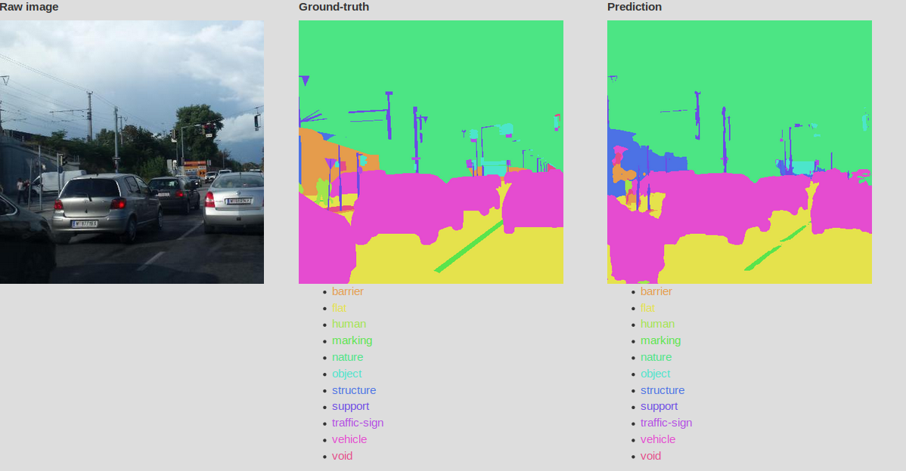
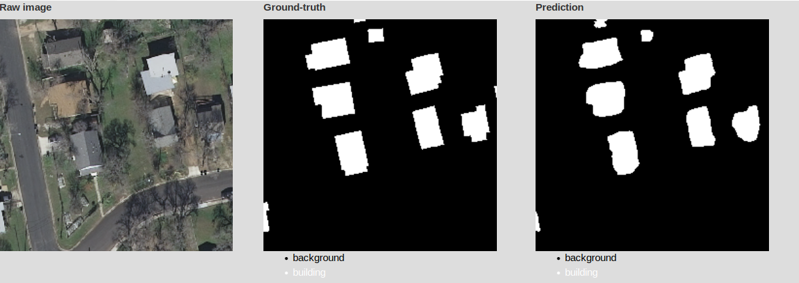

This project aims at showcasing some Deep Learning use cases in terms of image
analysis, especially regarding semantic segmentation.

If you want to get more details on Oslandia activities around this topic, feel
free to visit our [blog](http://oslandia.com/en/blog/). You certainly want to
discover some of our results in the
associated [web application](http://data.oslandia.io/deeposlandia):


# Content

The project contains following folders:

+ [deeposlandia](./deeposlandia) contains main Python modules to train and test
  convolutional neural networks
+ [examples](./examples) contains some Jupyter notebooks that aim at
  describing data or basic neural network construction
+ [images](./images) contains some example images to illustrate the Mapillary
  dataset as well as some preprocessing analysis results
+ [tests](./tests) contains some test modules to guarantee the functioning of a
  bunch of snippets; it uses the `pytest` framework.

Additionally, running the code may generate extra subdirectories in the chosen
data repository.

# Installation

## Requirements

The code has been run with Python3. The dependencies are recalled in `setup.py`
file, and additional dependencies for developing purpose are listed in
`requirements-dev.txt`.

## From source

```
$ git clone https://github.com/Oslandia/deeposlandia
$ cd deeposlandia
$ virtualenv -p /usr/bin/python3 venv
$ source venv/bin/activate
(venv)$ python setup.py install
(venv)$ pip install -r requirements-dev.txt
```

# Supported datasets

## Mapillary

In this project we use a set of images provided
by [Mapillary](https://www.mapillary.com/), in order to investigate on the
presence of some typical street-scene objects (vehicles, roads,
pedestrians...). Mapillary released this dataset on July 2017, it
is [available on its website](https://www.mapillary.com/dataset/vistas) and may
be downloaded freely for a research purpose.

As inputs, Mapillary provides a bunch of street scene images of various sizes
in a `images` repository, and the same images after filtering process in
`instances` and `labels` repositories.

There are 18000 images in the training set, 2000 images in the validation set,
and 5000 images in the testing set. The testing set is proposed only for a
model test purpose, it does not contain filtered versions of images. The raw
dataset contains 66 labels, splitted into 13 categories. The following figure
depicts a prediction result over the 13-labelled dataset version.



## AerialImage (INRIA)

In
the
[Aerial image dataset](https://project.inria.fr/aerialimagelabeling/files/),
there are only 2 labels, i.e. `building` or `background` and consequently the
model aims at answering one single question for each image pixel: does this
pixel belongs to a building?

The dataset contains 360 images, one half for training one half for
testing. Each of these images are 5000*5000 `tif` images. Amongst the 180
training images, we assigned 15 training images to validation. One example of
this image from this dataset is depicted below.



## Shapes

To complete the project, and make the test easier, a randomly-generated shape
model is also available. In this dataset, some simple coloured geometric shapes
are inserted into each picture, on a total random mode. There can be one
rectangle, one circle and/or one triangle per image, or neither of them. Their
location into each image is randomly generated (they just can't be too close to
image borders). The shape and background colors are randomly generated as well.

# Running the code

## Data preprocessing

First of all, preprocessed versions of raw datasets has to be generated before
any neural network training:

```
python deeposlandia/datagen.py -D mapillary -s 224 -a -p ./any-data-path -t 18000 -v 2000 -T 5000
```

The previous command will generates a set of 224 * 224 images based on
Mapillary dataset. The raw dataset must be in `./any-data-path/input`. If the
`-a` argument is specified, the preprocessed dataset will be stored in
`./any-data-path/preprocessed/224_aggregated`, otherwise it will be stored in
`./any-data-path/preprocessed/224_full`. The aggregation is applied on dataset
labels, that can be grouped in Mapillary case (and only in Mapillary case) to
reduce their number from 65 to 11.

Additionally, the preprocessed dataset may contain less images than the raw
dataset: the `-t`, `-v` and `-T` arguments refer respectively to training,
validation and testing image quantities. The amount indicated as an example
correspond to raw dataset size.

For AerialImage dataset, a limited set of image sizes are supported. As smaller
tiles will be generated by cutting the big original image, a divisor of 5000 is
expected.

In the Shapes datase case, this preprocessing step generates a bunch of images
from scratch.

As an easter-egg feature, label popularity is also printed by this command
(proportion of images where each label appears in the preprocessed dataset).

## Model training

Then the model training itself may be undertaken:

```
python deeposlandia/train.py -M feature_detection -D mapillary -s 512 -e 5
```

In this example, 512 * 512 Mapillary images will be exploited from training a
feature detection model. Here the training will take place for five epoches. An
inference step is always undertaken at the end of the training.

Here comes the parameter handled by this program:
+ `-a`: aggregate labels (*e.g.* `car`, `truck` or `caravan`... into a
  `vehicle` labels); do nothing if applied to `shapes` dataset.
+ `-b`: indicate the batch size (number of images per training batch, 50 by
  default).
+ `-D`: dataset (either `mapillary` or `shapes`).
+ `-d`: percentage of dropped out neurons during training process. Default
  value=1.0, no dropout.
+ `-e`: number of epochs (one epoch refers to the scan of every training
  image). Default value=0, the model is not trained, inference is done starting
  from the last trained model.
+ `-h`: show the help message.
+ `-ii`: number of testing images (default to 5000, according to the Mapillary
  dataset).
+ `-it`: number of training images (default to 18000, according to the
  Mapillary dataset).
+ `-iv`: number of validation images (default to 2000, according to the
  Mapillary dataset).
+ `L`: starting learning rate. Default to 0.001.
+ `l`: learning rate decay (according to
  the [Adam optimizer definition](https://keras.io/optimizers/#adam)). Default
  to 1e-4.
+ `-M`: considered research problem, either `feature_detection` (determining if
  some labelled objects are on an image) or `semantic_segmentation`
  (classifying each pixel of an image).
+ `-N`: neural network architecture, either `simple` (default value), or
  `vgg16` for the feature detection problem, `simple` is the only handled
  architecture for semantic segmentation.
+ `-n`: neural network name, used for checkpoint path naming. Default to `cnn`.
+ `-p`: path to datasets, on the file system. Default to `./data`.
+ `-s`: image size, in pixels (height = width). Default to 256.

## Model testing

Trained models may be tested after the training process. Once a model is
trained, a checkpoint structure is recorded in
`<datapath>/<dataset>/output/<problem>/checkpoints/<instance-name>`. It is the
key point for inference.

The model testing is done as follows:

```
python deeposlandia/inference.py -D shapes -i ./data/shapes/preprocessed/64_full/testing/images/shape_00000.png
```

In this example, a label prediction will be done on a single image, for
`shapes` dataset in the feature detection case. The trained model will be
recovered by default in `<datapath>/<dataset>/output/<problem>/checkpoints/`,
by supposing that an optimized model (*e.g.* regarding hyperparameters) has
been produced. If the hyperparameters are specified (training batch size,
dropout rate, starting learning rate, learning rate decay, model architecture
and even model name), knowing that the image size is given by the first tested
image, the trained model is recovered in
`<datapath>/<dataset>/output/<problem>/checkpoints/<instance>/`, where
`<instance>` is defined as:

```
<model_name>-<image_size>-<network_architecture>-<batch_size>-<aggregation_mode>-<dropout>-<start_lr>-<lr_decay>
```

If no trained model can be found in the computed path, the label prediction is
done from scratch (and will be rather inaccurate...).

The list of handled parameters is as follows:
+ `-a`: aggregate labels. Used to point out the accurate configuration file, so
  as to get the number of labels in the dataset.
+ `-b`: training image batch size. Default to `None` (aims at identifying
  trained model).
+ `-D`: dataset (either `mapillary` or `shapes`)
+ `-d`: percentage of dropped out neurons during training process. Default to
  `None` (aims at identifying trained model).
+ `-i`: path to tested images, may handle regex for multi-image selection.
+ `L`: starting learning rate. Default to `None` (aims at identifying trained
  model).
+ `l`: learning rate decay (according to
  the [Adam optimizer definition](https://keras.io/optimizers/#adam)). Default
  to `None` (aims at identifying trained model).
+ `-M`: considered research problem, either `feature_detection` (determining if
  some labelled objects are on an image) or `semantic_segmentation`
  (classifying each pixel of an image).
+ `-N`: trained model neural network architecture. Default to `None` (aims at
  identifying trained model).
+ `-n`: neural network name. Default to `None` (aims at identifying trained model).
+ `-p`: path to datasets, on the file system. Default to `./data`.

## Flask application

A Flask Web application may be launched locally through
`deeposlandia/run_webapp.py`. By default, it is launched on `0.0.0.0/7897`.

Some symbolic links are needed to make the application work:
+ `deeposlandia/static/sample_images` must contain the sample images, depicted
  on application homepage as well as in demonstration web pages (before new
  images are generated).
+ `deeposlandia/static/shapes` refers to the server-side repository that
  contains shapes images and their labels.
+ `deeposlandia/static/mapillary_agg` refers to the server-side repository that
  contains Mapillary images and their aggregated labels, *i.e.* 13 labels that
  summarize the content of the 65 native Mapillary labels.
+ `deeposlandia/static/predicted_images` links to a temporary repository (for
  instance, `/tmp/deeposlandia/predicted/`) that contains images generated
  during the app session as well as their corresponding predicted labelled
  version.

These symlinks are created when the web application is launched. Their name as
well as their destination are defined in `config.ini`, a config file located on
the project root.

# License

The program license is described in [LICENSE.md](./LICENSE.md).

___

Oslandia, April 2018
