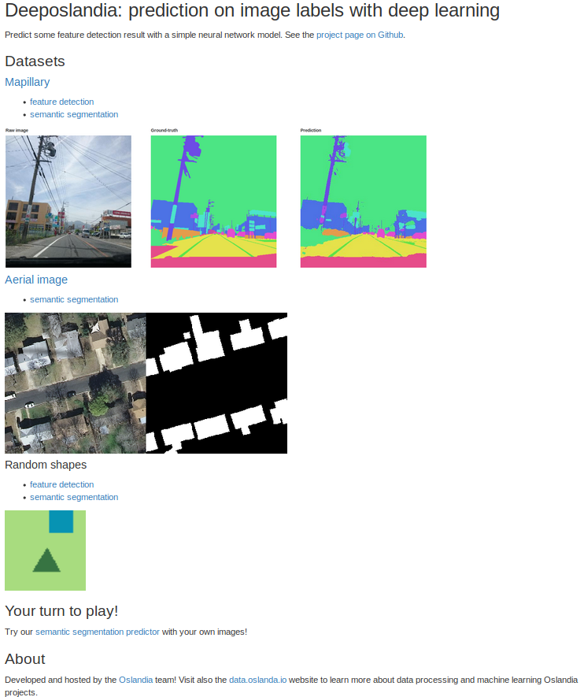

# Web application

## Oslandia version

This project allows to visualize some convolutional neural network results
(*click on the picture to visit and test it!*):

## Make your own version

The Web application is build with `Flask`, 
A Flask Web application may be launched locally through
`deeposlandia/run_webapp.py`. By default, it is launched on `0.0.0.0/7897`.

Some symbolic links are needed to make the application work (in development
mode):
+ `deeposlandia/static/sample_images` must contain the sample images, depicted
  on application homepage as well as in demonstration web pages (before new
  images are generated).
+ `deeposlandia/static/shapes` refers to the server-side repository that
  contains shapes images and their labels.
+ `deeposlandia/static/mapillary_agg` refers to the server-side repository that
  contains Mapillary images and their aggregated labels, *i.e.* 13 labels that
  summarize the content of the 66 native Mapillary labels.
+ `deeposlandia/static/predicted_images` links to a temporary repository (for
  instance, `/tmp/deeposlandia/predicted/`) that contains images generated
  during the app session as well as their corresponding predicted labelled
  version.

These symlinks are created when the web application is launched. Their name as
well as their destination are defined in `config.ini`, a config file located on
the project root.
